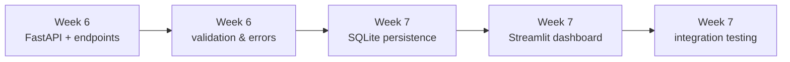

<div align="center">


<br><br>


</div>

## What this is

The two standalone modules from [`capstone-ai-modules`](https://github.com/HamzaButt22/capstone-ai-modules)
(resume categorization, face detection) wrapped in a FastAPI backend and driven from a Streamlit
dashboard — plus a SQLite log of every request either endpoint has handled.

This is Weeks 6–7 of the same internship as
[`student-management-system`](https://github.com/HamzaButt22/student-management-system) (Weeks
1–2), [`eda-data-pipeline`](https://github.com/HamzaButt22/eda-data-pipeline) (Week 3),
[`classical-ml-comparison`](https://github.com/HamzaButt22/classical-ml-comparison) (Week 4), and
[`capstone-ai-modules`](https://github.com/HamzaButt22/capstone-ai-modules) (Week 5). Same format
as all four: every day below is **what I was solving for → what I chose → what I didn't choose,
and why not.**

<br>

## Run it

```bash
git clone https://github.com/HamzaButt22/capstone-backend.git
cd capstone-backend
pip install fastapi uvicorn python-multipart pdfplumber spacy opencv-python sqlalchemy streamlit requests
python -m spacy download en_core_web_sm
```

**Backend:**
```bash
uvicorn main:app --reload
```
Visit `http://127.0.0.1:8000/docs` for the interactive Swagger UI and to try both endpoints
directly.

**Frontend** (in a second terminal, backend must already be running):
```bash
streamlit run app.py
```

A `transactions.db` SQLite file is created automatically on first run — no setup needed.

<br>

<div align="center"></div>

## How it grew



<br>

## Code, day by day

### Week 6 — Backend

| Day | Snapshot | What changed |
|---|---|---|
| 1 | [view code](https://github.com/HamzaButt22/capstone-backend/blob/899cbac1a93e9242dc15d65e09d1aa226f9c9728/main.py) | FastAPI app, root route, local dev server |
| 2 | [view code](https://github.com/HamzaButt22/capstone-backend/blob/87bb7dc7292daede660320345e7e8bf2d602fd13/main.py) | `/analyze-resume` endpoint, file upload handling |
| 3 | [view code](https://github.com/HamzaButt22/capstone-backend/blob/f54987a74c6f50da414980273bbff5e52e3b194d/main.py) | `/analyze-image` endpoint |
| 4 | [view code](https://github.com/HamzaButt22/capstone-backend/blob/85ec3060bae9ef15e9d8d45982ea7352200fd9f6/main.py) | file-type validation + `HTTPException` handling |
| 5 | [view code](https://github.com/HamzaButt22/capstone-backend) | full curl test pass, API docs, backend finalized |

### Week 7 — Persistence, frontend, integration

| Day | Snapshot | What changed |
|---|---|---|
| 1 | [view code](https://github.com/HamzaButt22/capstone-backend/blob/d1372c274c4cb6d776efe0f3c3a0b7d4703c865e/main.py) | SQLite connection layer, `FileTransaction` table |
| 2 | [view code](https://github.com/HamzaButt22/capstone-backend/blob/cf37ab9357322afd5dd50c1626418bab314739c5/main.py) | resume results logged to SQL via dependency injection |
| 3 | [view code](https://github.com/HamzaButt22/capstone-backend/blob/5e3abc3ddc6d717fe5fe0a5db43f5e10447d63dd/main.py) | image results logged to SQL |
| 4 | [view code](https://github.com/HamzaButt22/capstone-backend/blob/a3fb7237ca30860d61ad30dc3b4af5babd9da7ea/app.py) | Streamlit dashboard, both endpoints wired up |
| 5 | [view code](https://github.com/HamzaButt22/capstone-backend) | end-to-end integration test, empty/oversized-file guards added |

*Day 5 of Week 7 also carries a small fix made during review: the file-validation from Week 6
Day 4 checked file **type** but not whether an upload was empty or oversized, which the original
task actually called for. That guard is added in `main.py` now — see the decision log below.*

<br>

## The decision log

<details>
<summary><b>Week 6, Day 1 — A synchronous root route on an async app, on purpose</b></summary>
<br>

**Solving for:** a FastAPI app that actually runs, before anything else gets added to it.

**Decision:**
```python
app = FastAPI()

@app.get("/")
async def root():
    return {"message": "Hello World", "status": "FastAPI Server Running"}
```

`async def` on a route that does no I/O doesn't buy anything by itself — the payoff comes later,
once the upload endpoints do real (awaitable) work like reading file bytes. Starting every route
as `async` from day one just keeps the pattern consistent across the file instead of mixing sync
and async handlers for no reason.

</details>

<details>
<summary><b>Week 6, Day 2 — Buffering the upload to disk before analyzing it</b></summary>
<br>

**Solving for:** getting an uploaded PDF from an HTTP request into something `analyze_resume()`
(which expects a file path) can read.

**Decision:**
```python
temp_path = f"temp_{file.filename}"
with open(temp_path, "wb") as buffer:
    buffer.write(contents)
```

`analyze_resume()` was written in Week 5 against a file path, not a stream — rewriting it to take
raw bytes wasn't worth it for a module that already worked, so the smaller change is at the API
layer: buffer the upload to a temp file, run the existing function unchanged, then clean the temp
file up. The `try/finally` around this (added Week 6 Day 4) is what guarantees that cleanup
actually happens even if analysis raises an error partway through.

</details>

<details>
<summary><b>Week 6, Day 3 — One endpoint per module, not one endpoint that branches</b></summary>
<br>

**Solving for:** exposing `analyze_image()` alongside the resume endpoint.

**Decision:**
```python
@app.post("/analyze-image")
async def web_analyze_image(file: UploadFile = File(...), db: Session = Depends(get_db)):
    ...
```

A single `/analyze` endpoint that branches on file extension was the other real option. Two
separate routes were chosen instead because the two modules return genuinely different response
shapes (`predicted_category` + `extracted_skills` vs. `face_detected` + `count`) — a caller
building against this API gets a clear, typed contract per route instead of one endpoint whose
output schema depends on what you happened to upload.

</details>

<details>
<summary><b>Week 6, Day 4 — Extension checks were only half the task</b></summary>
<br>

**Solving for:** the actual Week 6 Day 4 task — "error handling (invalid file types, **empty
uploads, oversized files**) and input validation across both endpoints."

**Original decision:**
```python
if not file.filename.lower().endswith('.pdf'):
    raise HTTPException(status_code=400, detail="Invalid file type...")
```

**What was missing, found during review:** this only checked the file's *name*. A request with a
`.pdf` filename but zero bytes, or a multi-hundred-megabyte file, would sail past this check and
fail later — either silently (an empty PDF just produces no text) or expensively (a huge file
gets fully buffered to disk before anything rejects it).

**Fix applied:**
```python
contents = await file.read()
if not contents:
    raise HTTPException(status_code=400, detail="Uploaded file is empty.")
if len(contents) > MAX_FILE_SIZE:
    raise HTTPException(status_code=400, detail=f"File too large. Max size is {MAX_FILE_SIZE // (1024*1024)}MB.")
```

5MB was picked as the ceiling because both analyzers work on single documents/photos, not batches
or high-res scans — generous enough for a normal resume or headshot, small enough to reject the
kind of file that shouldn't be hitting these endpoints at all. This runs before the file is ever
written to disk, so a bad upload never touches the filesystem in the first place.

</details>

<details>
<summary><b>Week 7, Day 1 — SQLite over Postgres, and this wasn't in the original plan</b></summary>
<br>

**Solving for:** wanting a record of every analysis request, not just the response returned to the
caller.

**Worth flagging directly:** the 8-week syllabus for Week 7 was Streamlit basics → resume UI →
image UI → integration testing → buffer day. It didn't call for a database layer at all. Adding
one was extra scope taken on beyond the plan, not a syllabus requirement — worth being upfront
about rather than presenting it as if it were always part of the assignment.

**Decision:**
```python
SQLALCHEMY_DATABASE_URL = "sqlite:///./transactions.db"
engine = create_engine(SQLALCHEMY_DATABASE_URL, connect_args={"check_same_thread": False})
```

SQLite over Postgres/MySQL because this runs locally with zero setup — `check_same_thread=False`
is the one non-default needed to make SQLite (which is single-threaded by default) tolerate
FastAPI's request handling. The tradeoff: this doesn't hold up under real concurrent writes, which
is fine for a local capstone demo and would need revisiting for anything actually deployed with
multiple users.

</details>

<details>
<summary><b>Week 7, Day 2 — Logging results through a request-scoped session, not a global one</b></summary>
<br>

**Solving for:** writing each resume analysis result to the database without leaking connections
across requests.

**Decision:**
```python
def get_db():
    db = SessionLocal()
    try:
        yield db
    finally:
        db.close()
```

FastAPI's `Depends(get_db)` pattern opens a fresh session per request and guarantees it closes
afterward, even on error — a single module-level session shared across all requests was the
simpler-looking alternative, but it would let one slow or failed request hold a connection open
that every other request is implicitly waiting behind.

</details>

<details>
<summary><b>Week 7, Day 3 — Same logging shape for images as for resumes</b></summary>
<br>

**Solving for:** keeping the image endpoint's database logging consistent with the resume
endpoint's, rather than inventing a second pattern.

**Decision:**
```python
db_transaction = models.FileTransaction(
    filename=file.filename,
    file_type="image",
    status="Success",
    result_summary=f"Face Detected: {face_detected} | Count: {face_count}",
)
```

One `FileTransaction` table with a `file_type` column, instead of separate `resume_logs` and
`image_logs` tables. A single table means one place to query "everything that happened," at the
cost of `result_summary` being a loosely-structured string rather than real typed columns — fine
for a capstone, but the first thing to revisit if this needed to support filtering or analytics
over past results.

</details>

<details>
<summary><b>Week 7, Day 4 — A Streamlit page that calls the API like any other client</b></summary>
<br>

**Solving for:** a working UI for both modules that doesn't reach into their internals.

**Decision:**
```python
files = {"file": (resume_file.name, resume_file.getvalue(), "application/pdf")}
response = requests.post("http://127.0.0.1:8000/analyze-resume", files=files)
```

`app.py` talks to `main.py` purely over HTTP, the same way any external client would — it never
imports `analyze_resume` or `analyze_image` directly. That keeps frontend and backend genuinely
decoupled: the backend could be swapped, redeployed, or written in a different language entirely
without the frontend caring, since all it knows about is the API contract.

</details>

<details>
<summary><b>Week 7, Day 5 — Integration testing surfaced the Day 4 gap, not a new bug</b></summary>
<br>

**Solving for:** confirming backend and frontend actually work together end-to-end, not just in
isolation.

**What testing found:** running both together with a range of inputs (a 0-byte file, an
oversized image, a mistyped extension) is what surfaced that Week 6 Day 4's validation was
incomplete — see that entry above. No new features were added on this day; the fix belongs to
Day 4's task, it just wasn't caught until this integration pass exercised the edge cases the
original test round hadn't.

</details>

<br>

## What's next

Weeks 6–7 of an 8-week AI/ML internship track, following
[`student-management-system`](https://github.com/HamzaButt22/student-management-system) (Weeks
1–2), [`eda-data-pipeline`](https://github.com/HamzaButt22/eda-data-pipeline) (Week 3),
[`classical-ml-comparison`](https://github.com/HamzaButt22/classical-ml-comparison) (Week 4), and
[`capstone-ai-modules`](https://github.com/HamzaButt22/capstone-ai-modules) (Week 5). Week 8 is
deployment, final documentation, and sign-off — all five repos link back to the hub below once
that's done.

<br>

<div align="center">

**Part of the [AI/ML Internship Journey](https://github.com/HamzaButt22/ai-ml-internship) — start there for the full story.**

</div>